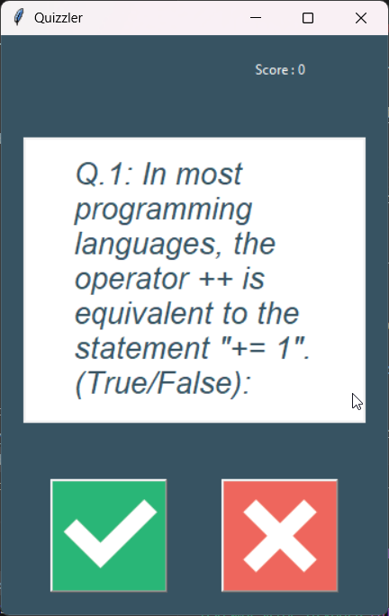
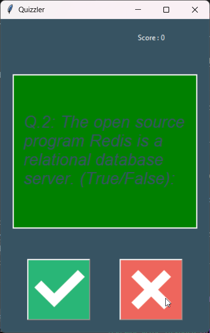
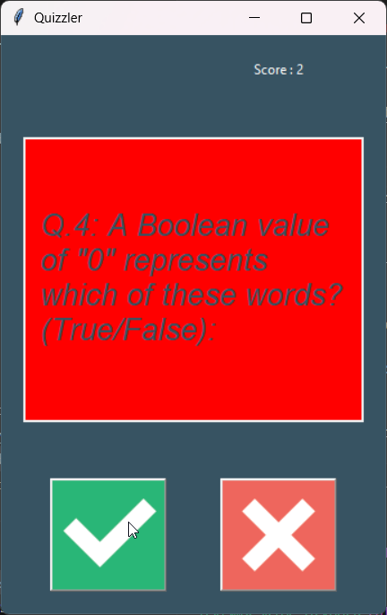

# 🧠 Quizzler - Python Quiz App

Quizzler is an interactive quiz application built with Python. It fetches real-time questions from the [Open Trivia Database](https://opentdb.com/) and presents them in a user-friendly graphical interface using Tkinter. The quiz is focused on **True/False** questions, and users receive instant feedback and score updates.


---

## 🚀 Features

- ✅ Real-time question fetching via REST API
- ✅ Beautiful and responsive GUI with Tkinter
- ✅ Score tracking and end-of-quiz summary
- ✅ HTML entity decoding for proper question formatting
- ✅ Object-oriented structure with clean code organization

---

## 📁 Project Structure

```

quizzler/
├── images/
│   ├── true.png
│   └── false.png
├── screenshots/
│   ├── screenshot1.png
│   └── screenshot2.png
├── .gitignore
├── data.py
├── LICENSE
├── main.py
├── question_model.py
├── quiz_brain.py
├── README.md
├── requirements.txt
└── ui.py


````

---

## 🧰 Technologies Used

- **Python 3.x**
- **Tkinter** – for GUI
- **Requests** – for API data fetching
- **Open Trivia DB API** – for quiz content

---

## ▶️ How to Run

1. **Clone the repository**:
   ```bash
   git clone https://github.com/sreejith-as/quizzler.git
   cd quizzler
````

2. **Install dependencies**:

   ```bash
   pip install -r requirements.txt
   ```

   > 💡 Note: Only `requests` needs to be installed separately; `tkinter` is built into most Python distributions.

3. **Run the application**:

   ```bash
   python main.py
   ```

---

## 📸 Screenshots

<!-- Add actual screenshots in the /images directory and link them here -->

<div align="center">
  
  
  
</div>

---

## 🔍 API Reference

* [Open Trivia Database API](https://opentdb.com/api_config.php)

  * Parameters used:

    * `amount=10`
    * `type=boolean`
    * `category=18` (Science: Computers)

---

## 📌 To-Do / Improvements

* [ ] Add multiple-choice support
* [ ] Add difficulty level selector
* [ ] Add progress bar or timer
* [ ] Add user login and score tracking

---

## 📄 License

This project is licensed under the [MIT License](LICENSE).

---

## 🤝 Contributing

Pull requests are welcome! For major changes, please open an issue first to discuss what you'd like to change.

---

## 👤 Author

**Sreejith A S**
📍 Kerala, India
🔗 [LinkedIn](www.linkedin.com/in/sreejith-a-sreenivasan)
📧 [sreejithsreenivasan.06@gmail.com](mailto:sreejithsreenivasan.06@gmail.com)

---

## 💬 Feedback

If you have any suggestions or feedback, feel free to open an issue or reach out via email.

